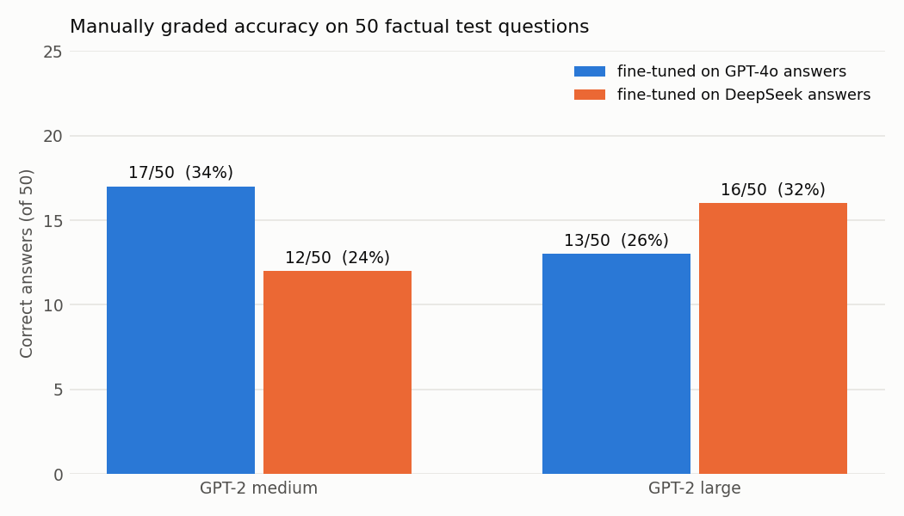
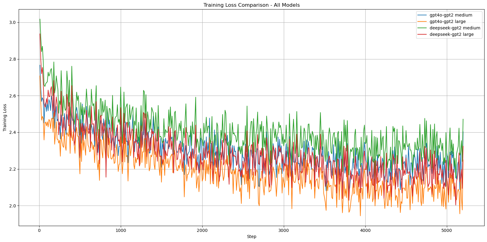

# Instruction Fine-Tuning Turkish GPT-2 with LoRA: GPT-4o vs. DeepSeek as Teachers

Does it matter **which LLM wrote the answers** you fine-tune on? This project fine-tunes two sizes of a Turkish GPT-2 with **LoRA** on 13,891 questions. One version of the data uses **GPT-4o** answers, the other uses **DeepSeek** answers. The four resulting models are compared on training loss and on a manually graded factual test set.



---

## Setup

| | |
|---|---|
| **Base models** | [`ytu-ce-cosmos/turkish-gpt2-medium`](https://huggingface.co/ytu-ce-cosmos/turkish-gpt2-medium), [`ytu-ce-cosmos/turkish-gpt2-large`](https://huggingface.co/ytu-ce-cosmos/turkish-gpt2-large) |
| **Method** | Supervised fine-tuning with TRL `SFTTrainer` + PEFT LoRA adapters |
| **LoRA** | `r=16`, `alpha=32`, `dropout=0.05`, target modules `c_attn`, `c_proj` |
| **Training** | 3 epochs · lr `2e-4` · effective batch size 8 · bf16 · 5,208 steps |
| **Prompt format** | `Soru: <question>\nCevap: <answer>` (Turkish for "Question / Answer") |

### Data

The course provided 13,891 Turkish questions. Each question has an answer from GPT-4o, an answer from DeepSeek, and a human label saying which answer is better:

| Label | Share |
|---|---|
| Both answers good | 51.3% |
| DeepSeek better | 23.1% |
| GPT-4o better | 20.4% |
| Both bad | 5.1% |

- Questions are short (mean 8.8 words), while answers are long and vary a lot: GPT-4o averages 79.7 words, DeepSeek 84.5 words (up to 1,027).
- In 51.7% of the cases GPT-4o's answer is longer.
- Questions where both models failed are mostly open-ended "why" and "what if" questions.

From this data, two instruction datasets were built: **V1 (question + GPT-4o answer)** and **V2 (question + DeepSeek answer)**.

---

## Results

| Base model | Training answers | Training time | Loss (first → last) | Correct on 50-question test |
|---|---|---|---|---|
| GPT-2 medium | GPT-4o | ~29 min | 2.77 → 2.30 | **17 / 50 (34%)** |
| GPT-2 large | GPT-4o | ~82 min | 2.71 → **2.19** | 13 / 50 (26%) |
| GPT-2 medium | DeepSeek | ~32 min | 3.02 → 2.41 | 12 / 50 (24%) |
| GPT-2 large | DeepSeek | ~85 min | 2.94 → 2.28 | 16 / 50 (32%) |

The test set has 50 short factual questions across 8 categories: history, science, geography, general knowledge, health, literature, math and technology. Each answer was graded manually against a reference answer. All generated answers are in [`results/model_answers/`](results/model_answers/).



### Findings

- **GPT-4o answers are easier to learn.** For both model sizes, training on GPT-4o answers gives a lower loss than training on DeepSeek answers. The DeepSeek answers are longer and more varied.
- **Lower loss does not mean more correct facts.** GPT-2 large on GPT-4o data has the lowest loss but only 26% accuracy. The models learn the *style* of the teacher (fluent, confident, long explanations) much faster than factual knowledge.
- **Hallucination is the main failure mode.** Typical answers are well-formed but wrong: "Magna Carta was signed in 1516", for example. A 50-question test is small, so the differences between the four runs are not statistically significant.
- **Possible next steps:** a larger evaluation set with automatic scoring, shorter target answers for factual questions, and retrieval augmentation.

---

## Repository structure

```
├── notebooks/
│   ├── 01_dataset_analysis.ipynb   # length stats, preference labels, JSONL dataset creation, loss curves
│   └── 02_lora_finetuning.ipynb    # 4 LoRA runs + generation on the 50-question test set
├── results/model_answers/          # generated answers (+ manual grades) per model
├── figures/
└── requirements.txt
```

## Getting started

```bash
git clone https://github.com/ezgiieyice/turkish-gpt2-lora-finetuning.git
cd turkish-gpt2-lora-finetuning
pip install -r requirements.txt
jupyter notebook notebooks/
```

- A CUDA GPU with bf16 support is needed (switch to `fp16=True` otherwise). The large runs took about 85 minutes each.
- `01_dataset_analysis.ipynb` creates the `v1_dataset_gpt4o.jsonl` and `v2_dataset_deepseek.jsonl` training files.
- Fine-tuned adapters and the training-loss log are not included in the repo because of their size.

## Tech stack

Python · PyTorch · Hugging Face Transformers · TRL · PEFT (LoRA) · Datasets · pandas · Matplotlib · Seaborn

---

*Assignment for the graduate course **Computational Semantics** at Yıldız Technical University (2025).*
